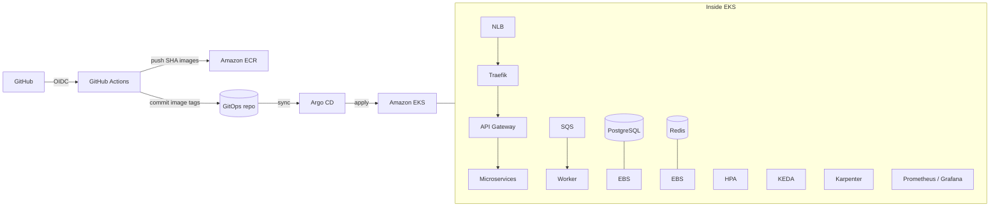

# EKS v2 – Order Fulfillment Platform

Production-style multi-service order platform on **Amazon EKS**: nine Go microservices, in-cluster PostgreSQL and Redis, SQS eventing, GitOps with Argo CD, and GitHub Actions (OIDC) for CI/CD — with DevSecOps controls (IRSA, External Secrets, Trivy, NetworkPolicies).

Application service code is provided. This repository owns the Dockerfiles, Terraform, Kubernetes/GitOps layout, pipelines, evidence, and operational docs.

---

## Project status

The platform was **successfully deployed to AWS EKS**, validated end-to-end (HTTPS dashboard, nine healthy services, GitOps, scaling, persistence, monitoring), and **evidence was captured** under [`docs/evidence/`](docs/evidence/). The **AWS development environment was subsequently destroyed** to control costs. Infrastructure code and validation records remain in Git for review and redeploy.

---

## Project results

Successfully demonstrated:

| Area | What was proven |
|------|-----------------|
| **EKS** | VPC + private subnets, managed system nodes, workloads on Kubernetes |
| **Nine services** | api-gateway, order, inventory, payment, notification, shipping, dashboard-api, worker, scheduler — all Ready |
| **HTTPS** | Traefik → NLB, live `/healthz` and dashboard over TLS |
| **Argo CD** | App-of-Apps Synced/Healthy; self-heal after live drift |
| **ECR** | Immutable SHA-tagged images via OIDC release pipeline |
| **SQS** | Order events queue + DLQ; worker consumption path |
| **IRSA** | Workload ServiceAccounts → IAM roles (no static AWS keys in pods) |
| **External Secrets** | Secrets Manager → Kubernetes Secrets (`SecretSynced`) |
| **Persistent storage** | Postgres/Redis on gp3 EBS; pod delete survival; VolumeSnapshot |
| **Autoscaling** | HPA (HTTP), KEDA (SQS depth), Karpenter (nodes) |
| **Monitoring** | kube-prometheus-stack + Grafana dashboards |

Browse evidence: [`docs/evidence/`](docs/evidence/) · Screenshots: [`docs/evidence/screenshots/`](docs/evidence/screenshots/)

---

## Architecture

```text
GitHub (push)
    │
    ▼
GitHub Actions + OIDC ──► AWS IAM roles (app / infra)
    │
    ├─► Amazon ECR  (immutable <git-sha> images)
    │
    └─► Git commit (dev Kustomize overlay image tags)
              │
              ▼
         Argo CD (GitOps pull)
              │
              ▼
         Amazon EKS
              │
    ┌─────────┴──────────────────────────────────────┐
    │  NLB → Traefik → API Gateway → microservices   │
    │                                                │
    │  SQS ──────────────► Worker (KEDA)             │
    │  PostgreSQL ── EBS (gp3)                       │
    │  Redis ─────── EBS (gp3)                       │
    │  HPA · KEDA · Karpenter                        │
    │  Prometheus / Grafana                          │
    └────────────────────────────────────────────────┘
```



More detail: [`docs/architecture/architecture.md`](docs/architecture/architecture.md)

---

## Why EKS?

EKS is the right fit for this portfolio platform because it combines managed Kubernetes control plane with full control of networking, IAM (IRSA), GitOps, and autoscaling — the same operational surface used in production AWS environments — without outsourcing the cluster API to a PaaS.

---

## Technology stack

AWS · EKS · Terraform · Kubernetes · Docker · GitHub Actions · Argo CD · ECR · SQS · Karpenter · KEDA · Traefik · External Secrets · cert-manager · Prometheus · Grafana · Go

---

## Repository layout

```text
services/                     # Nine Go microservices + Dockerfiles
kubernetes/
  applications/               # Per-service Deployments, Services, HPAs, NetworkPolicies, ExternalSecrets
  platform/                   # Postgres, Redis, Traefik, Argo CD, controllers
  overlays/dev/               # Dev Kustomize overlay (ECR SHA image tags)
terraform/environments/dev/   # VPC, EKS, IAM/IRSA, ECR, SQS, OIDC, Secrets, KMS
.github/workflows/
  infra-ci.yml                # Terraform fmt / init / validate / TFLint / Checkov
  app-ci.yml                  # Go test/vet/lint, Hadolint, Docker build, Trivy, Kustomize
  app-release.yml             # OIDC → ECR push (SHA tags) → GitOps image bump
docs/
  evidence/                   # Validation evidence by topic + screenshots
  runbooks/                   # Deploy, rollback, recovery, Argo CD, cost
  architecture/               # Architecture notes
```

---

## Services

| Service | Port | Role |
|---------|------|------|
| api-gateway | 8080 | Auth, rate limit, routing |
| order-service | 8081 | Order lifecycle |
| inventory-service | 8082 | Stock / reservations |
| payment-service | 8083 | Payments / ledger |
| notification-service | 8084 | Email / SMS |
| shipping-service | 8085 | Shipments / tracking |
| dashboard-api | 8086 | Admin UI + analytics |
| worker | — | SQS consumer / orchestration |
| scheduler | — | Cron (expiry, retries) |

---

## How CI/CD works

```text
Git push
  → Application CI (test, lint, build, scan, kustomize)
  → Application Release (main)
  → GitHub OIDC → IAM (app role) → ECR login
  → Build changed services → Trivy CRITICAL hard gate
  → Push eks-v2-dev-<service>:<git-sha>
  → Commit SHA into kubernetes/overlays/dev (Kustomize)
  → Argo CD syncs → EKS rolling update
```

Infra changes use `infra-ci.yml` and a **separate** infra OIDC role so an app commit cannot widen Terraform permissions.

Production image tags are the short Git SHA (never `latest`). Rollback = set the overlay tag to a previous SHA and let Argo CD sync. See [`docs/runbooks/`](docs/runbooks/).

---

## How GitOps works

Desired state lives in Git (`kubernetes/`). Argo CD **pulls** and reconciles; CI does **not** `kubectl apply` workloads. The release workflow only updates image tags in the Kustomize overlay, then Argo CD rolls out.

Self-heal was demonstrated: live replica drift was reverted to the Git-desired value. See [`docs/evidence/gitops/`](docs/evidence/gitops/).

---

## How secrets are handled

1. Terraform creates Secrets Manager entries (database URL, JWT, etc.).
2. External Secrets Operator (IRSA) syncs them into Kubernetes `Secret` objects.
3. Pods consume via `secretKeyRef` / envFrom — no long-lived AWS keys in Git or Actions (OIDC + IRSA).

---

## How the system scales

| Layer | Mechanism | Signal |
|-------|-----------|--------|
| HTTP services | **HPA** | CPU / memory |
| Worker | **KEDA** | SQS queue depth |
| Nodes | **Karpenter** | Pending pods / EC2 capacity |

Postgres and Redis stay fixed-replica StatefulSets (scale storage/vertically, not HPA).

---

## How data is persisted and restored

- Postgres: StatefulSet, 20Gi gp3 PVC (EBS CSI).
- Redis: StatefulSet, 10Gi gp3, AOF.
- Backup drill: VolumeSnapshot → new PVC from snapshot → attach → verify data.

Runbooks: [`docs/runbooks/postgresql-recovery.md`](docs/runbooks/postgresql-recovery.md)

---

## How it is monitored

kube-prometheus-stack (Prometheus + Grafana) collects cluster/workload metrics. Evidence: [`docs/evidence/monitoring/`](docs/evidence/monitoring/).

---

## How it recovers from failure

| Failure | Recovery |
|---------|----------|
| Bad image / unhealthy rollout | Revert GitOps SHA → Argo CD restores previous version |
| Manual cluster drift | Argo CD self-heal → Git desired state |
| Failed SQS processing | Retries → DLQ → investigate / replay |
| Postgres pod loss | StatefulSet + PVC; snapshot restore if volume lost |
| Node pressure | Karpenter provisions; consolidation when idle |

---

## Security posture

- **No static AWS keys** in the repo or GitHub Actions (OIDC).
- **IRSA** for pod → AWS API access.
- **External Secrets** for Secrets Manager → Kubernetes.
- **Trivy CRITICAL** is a hard gate on Application Release (`exit-code: 1`).
- App containers use **distroless** images and run as **nonroot**.
- NetworkPolicies default-deny where applied.

Security review notes: [`docs/evidence/security/`](docs/evidence/security/).

---

## Trade-offs

- **Postgres in-cluster** (assignment requirement) instead of RDS Multi-AZ — we own PVC AZ affinity, snapshots, and restore drills.
- **Self-signed / Traefik TLS** for the live demo hostname without public DNS; attach Route 53 + Let's Encrypt for a public CA.
- **No NAT** (VPC endpoints) to reduce cost; private workloads reach AWS APIs via endpoints.
- **Dev environment destroyed after validation** — evidence and IaC remain; live demos require redeploy.

---

## Local development

```bash
docker compose up --build
```

---

## CI / CD workflows

| Workflow | Trigger | Purpose |
|----------|---------|---------|
| `infra-ci.yml` | `terraform/**` | fmt, init, validate, TFLint, Checkov |
| `app-ci.yml` | `services/**`, `kubernetes/**` | Go test/vet/golangci-lint, Hadolint, Docker build, Trivy, Kustomize |
| `app-release.yml` | `services/**` on `main`, or manual | OIDC → build → Trivy hard gate → ECR → GitOps tag bump |

Release needs Terraform applied and `AWS_ROLE_ARN_APP` configured when a live environment exists. OIDC trust is scoped to this repo’s `main` ref and `environment:dev`.

---

## Evidence map

| Topic | Path |
|-------|------|
| CI / OIDC / ECR | [`docs/evidence/ci/`](docs/evidence/ci/) |
| GitOps / Argo CD | [`docs/evidence/gitops/`](docs/evidence/gitops/) |
| Security (IRSA, ESO, NetworkPolicy) | [`docs/evidence/security/`](docs/evidence/security/) |
| Networking / HTTPS | [`docs/evidence/networking/`](docs/evidence/networking/) |
| Scaling (HPA, KEDA, Karpenter) | [`docs/evidence/scaling/`](docs/evidence/scaling/) |
| Storage / persistence | [`docs/evidence/storage/`](docs/evidence/storage/) |
| Monitoring | [`docs/evidence/monitoring/`](docs/evidence/monitoring/) |
| Resilience (self-heal, SQS, rollback) | [`docs/evidence/resilience/`](docs/evidence/resilience/) |
| Screenshot gallery | [`docs/evidence/screenshots/`](docs/evidence/screenshots/) |
| Phase run log | [`docs/PHASES.md`](docs/PHASES.md) |

---

## Operational runbooks

| Topic | Doc |
|-------|-----|
| Application deployment | [`docs/runbooks/application-deployment.md`](docs/runbooks/application-deployment.md) |
| Rollback | [`docs/runbooks/rollback.md`](docs/runbooks/rollback.md) |
| PostgreSQL recovery | [`docs/runbooks/postgresql-recovery.md`](docs/runbooks/postgresql-recovery.md) |
| DLQ recovery | [`docs/runbooks/dlq-recovery.md`](docs/runbooks/dlq-recovery.md) |
| Argo CD failure | [`docs/runbooks/argocd-failure.md`](docs/runbooks/argocd-failure.md) |
| Cost control | [`docs/runbooks/cost-control.md`](docs/runbooks/cost-control.md) |

---

## Deliverables checklist

- [x] Dockerfiles (multi-stage → distroless nonroot)
- [x] Terraform (VPC, EKS, IAM/IRSA, ECR, SQS, OIDC, Secrets, KMS, endpoints)
- [x] Kubernetes manifests (Kustomize)
- [x] Argo CD App-of-Apps layout
- [x] Separated GitHub Actions (infra CI, app CI, app release)
- [x] Working deployment — all services healthy, E2E order flow
- [x] Dashboard over HTTPS at Traefik NLB
- [x] Persistence / snapshot / rollback / scaling demos with evidence
- [x] Environment torn down after validation (cost control)

---

## Final status

AWS EKS was deployed and validated; evidence and screenshots are in this repository. The development infrastructure was **destroyed afterwards** to prevent unnecessary AWS charges. To re-demonstrate live behaviour, re-apply Terraform, restore GitHub OIDC secrets, and re-run Application Release.
